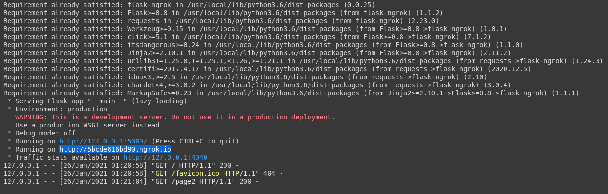
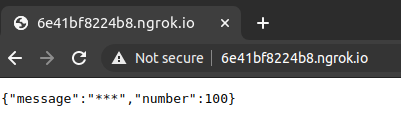
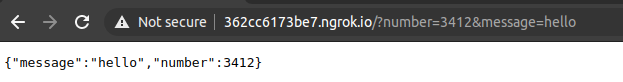

# Workshop 1 Flask From Zero

It is an important skill for a developer to pick up pattern and apply them quickly. 

The object of this workshop is **not to learn everything about Flask**. Instead, it's intended to emulate the **workflow and learning processes** on acquiring knowledge and be ready for certain tasks/topics quickly. 


Objectives: 

- learn about Flask
- run Flask server
- get arguments from Flask routes
- learn about json api


Throughout the workshop, in your own words, please fill out all the `TODO:` tags


## Google Colab

Go to google colab and start a new notebook:

https://colab.research.google.com/


## Flask

Quick start guide:

https://flask.palletsprojects.com/en/1.1.x/quickstart/#quickstart

TODO(google): What is flask?

Copy and paste the following code into the first Colab console and run the code: 

```
!pip install flask-ngrok 
from flask_ngrok import run_with_ngrok
from flask import Flask
app = Flask(__name__)
run_with_ngrok(app)

@app.route('/')
def hello_world():
    return '<h1> Hello, World! <h1>'
app.run()
# the above code has been modified to run in google colab
```
(Please make an attempt to get the Colab environment running. If you find it challenging, please refer to this tutorial https://colab.research.google.com/notebooks/intro.ipynb# )

We should be able to see something similar in this console output.



Navigate to the link in the output. 

example: `* Running on http://4e4800b7321c.ngrok.io`


# Flask callback

##### Problem:

You are given the following code, and was asked to **get url query parameters** from the **flask routes**. 

```
!pip install flask-ngrok
from flask_ngrok import run_with_ngrok
from flask import Flask
from flask import request

app = Flask(__name__)
run_with_ngrok(app)

@app.route('/')
@app.route('/requests')
def requests():
    number = 100
    message = '***'
    return {
        'number': number,
        'message': message,
    }

app.run()
```

TODO: repeat the previous steps to get this code to run, and visit the `ngrok.io link`



## Requests

You're fairly new to python, and have only hear about flask today. So you do not understand how to use `request`.  


Even after reading the official website, you still find it challenging. [You then googled a bit more and found the following code snippet](https://stackoverflow.com/questions/24892035/how-can-i-get-the-named-parameters-from-a-url-using-flask ):


```
from flask import request

@app.route('/my-route')
def my_route():
  page = request.args.get('page', default = 1, type = int)
  filter = request.args.get('filter', default = '*', type = str)
```

as shown in the post, one example to send parameter to view function is:

```
/my-route?page=10&filter=test
```


you decided it's worth a try to experiment with modifying 

```
number = 100
message = '***'
```

to follow the pattern of

```
page = request.args.get('page', default = 1, type = int)
filter = request.args.get('filter', default = '*', type = str)
```


After you are finished, access the api via appending the following arguments

```
/?number=3412&message=hello
```

to  `http://362cc6173be7.ngrok.io` 





https://www.w3schools.com/js/js_json_syntax.asp after reading about json syntax, you realized you've just written a [Flask JSON API](https://www.google.com/search?q=flask+jsob+api&oq=flask+jsob+api). 


## Homework

1. Write a Flask JSON API takes the following url parameters

| Param     | type |
| --------- | ---- |
| firstname | str  |
| lastname  | str  |
| age       | int  |

2. start a github repository, upload your code to the repo
3. write a readme file to showcase your work


# Recommended Readings:

[official documentation](https://flask.palletsprojects.com/en/1.1.x/reqcontext/)

[How can I get the named parameters from a URL using Flask?](https://stackoverflow.com/questions/24892035/how-can-i-get-the-named-parameters-from-a-url-using-flask)


##### Extras

TODO(google): What is 

- WSGI server
- development server
- production deployment?

TODO: Google `request in flask` , and learn as much as possible about this topic in 10 minutes. 

TODO: in your own words, try to explain what is `request` in Flask. 